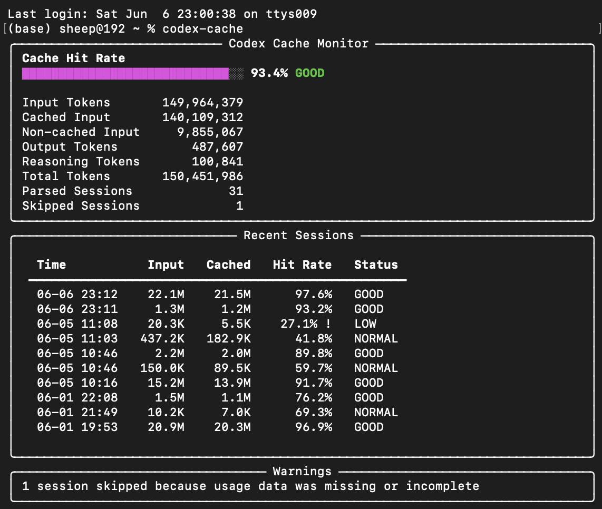

# codex-cache-monitor

A beautiful local terminal dashboard for Codex prompt cache visibility.

`codex-cache-monitor` is a small local CLI for reading OpenAI Codex CLI session logs and showing how well prompt caching is working. It focuses on:

- input tokens
- cached input tokens
- non-cached input tokens
- cache hit rate
- recent sessions

All data stays on your machine. No logs are uploaded.

## Screenshot



> Best viewed in terminals wider than 100 columns. Narrow terminal responsive layout is still being improved.

## 中文简介

`codex-cache-monitor` 是一个本地终端工具，用来查看 OpenAI Codex CLI 的 prompt cache 命中情况。它会读取本地 `~/.codex/sessions` 日志，展示 input tokens、cached input tokens、non-cached input tokens、cache hit rate 和 recent sessions。

所有数据都只在本地处理，不上传日志，也不会打印 prompt、response 或 tool output 原文。

## Preview

```text
╭──────────────────────────── Codex Cache Monitor ─────────────────────────────╮
│ Cache Hit Rate                                                               │
│ ███████████████████████████░░░ 92.8% GOOD                                    │
│                                                                              │
│ Input Tokens       135,342,453                                               │
│ Cached Input       125,641,472                                               │
│ Non-cached Input     9,700,981                                               │
│ Output Tokens          469,131                                               │
│ Reasoning Tokens        97,241                                               │
│ Total Tokens       135,811,584                                               │
│ Parsed Sessions             31                                               │
│ Skipped Sessions             1                                               │
╰──────────────────────────────────────────────────────────────────────────────╯
```

## Installation

Recommended with pipx:

```bash
pipx install codex-cache-monitor
codex-cache status
```

Or with pip:

```bash
python -m pip install codex-cache-monitor
codex-cache status
```

Upgrade:

```bash
pipx upgrade codex-cache-monitor
# or
python -m pip install --upgrade codex-cache-monitor
```

Local development install:

```bash
git clone https://github.com/Nver-theless/codex-cache-monitor.git
cd codex-cache-monitor
python -m venv .venv
source .venv/bin/activate
pip install -e ".[dev]"
```

Windows PowerShell:

```powershell
python -m venv .venv
.venv\Scripts\Activate.ps1
pip install -e ".[dev]"
```

Then run:

```bash
codex-cache --help
codex-cache status
```

## Quick Start

Run the dashboard:

```bash
codex-cache
```

Check launcher-friendly status output:

```bash
codex-cache status
codex-cache status --plain
codex-cache status --json
```

Write the local status file for tools that prefer reading cached state:

```bash
codex-cache status --write-state
```

The default state file is:

```text
~/.codex-cache-monitor/status.json
```

## Usage

```bash
codex-cache
codex-cache summary
codex-cache sessions
codex-cache sessions --limit 20
codex-cache watch
codex-cache watch --interval 5
codex-cache doctor
codex-cache export --json
codex-cache status
codex-cache status --plain
codex-cache status --json
codex-cache status --write-state
codex-cache --codex-home ~/.codex summary
```

Command behavior:

- `codex-cache` is the same as `codex-cache summary`.
- `summary` scans all sessions for aggregate metrics.
- `sessions` displays the latest 10 sessions by default.
- `sessions --limit N` changes how many recent sessions are shown.
- `status` prints one compact status line for integrations.
- `status --plain` prints only the cache hit rate and status.
- `status --json` emits metadata-only status JSON.
- `status --write-state` writes the local status file.
- `export --json` emits `summary + sessions + warnings`.
- `--codex-home PATH` points the tool at a specific Codex home directory.

By default, the tool reads:

- macOS, Linux, WSL: `~/.codex/sessions`
- Windows: `%USERPROFILE%\.codex\sessions`

## Status command

`codex-cache status` prints a compact one-line summary for shell prompts, Raycast, Alfred, Codex Hooks, and future menu bar apps.

```bash
codex-cache status
codex-cache status --plain
codex-cache status --json
codex-cache status --write-state
```

The default state file is:

```text
~/.codex-cache-monitor/status.json
```

Example output:

```text
Codex Cache: 93.4% GOOD · Input 149.9M · Cached 140.1M · Skipped 1
```

Plain output:

```text
93.4% GOOD
```

JSON output is a single metadata-only status object. It does not include prompts, responses, tool output, raw JSONL lines, or file contents.

## Integration model

`codex-cache-monitor` keeps parsing and display separate:

- The CLI parser reads local Codex session logs from `~/.codex/sessions`.
- `codex-cache status --write-state` writes `~/.codex-cache-monitor/status.json`.
- Hooks, Raycast, Alfred, or menu bar apps can read that status file without parsing Codex logs themselves.

## Integrations

`codex-cache-monitor` can be used by lightweight launcher tools and automation scripts through the `status` command.

Available integration docs:

- [Codex Hooks](docs/integrations/codex-hooks.md)
- [Raycast](docs/integrations/raycast.md)
- [Alfred](docs/integrations/alfred.md)

## Quick Launcher Examples

Ready-to-copy launcher scripts are available in `examples/`:

```text
examples/
├── alfred/
│   ├── codex-cache-plain.sh
│   └── codex-cache-status.sh
└── raycast/
    ├── codex-cache-detail.sh
    └── codex-cache-plain.sh
```

Each script checks whether `codex-cache` is available in `PATH` and prints a short setup hint if it cannot be found.

Raycast:

```bash
chmod +x examples/raycast/codex-cache-plain.sh
chmod +x examples/raycast/codex-cache-detail.sh
```

Add the `examples/raycast/` directory to Raycast Script Commands.

Alfred:

```bash
chmod +x examples/alfred/codex-cache-status.sh
chmod +x examples/alfred/codex-cache-plain.sh
```

Use either script in an Alfred Workflow Run Script action, or paste the script body into the action.

## Privacy

- Data stays local.
- No logs are uploaded.
- No network requests are made.
- Prompt, response, and tool output are never printed.
- JSON export contains metrics and file metadata only.

The JSON export intentionally excludes raw JSONL lines, file contents, prompt text, response text, command text, and tool output text.

## Difference from ccusage

`ccusage` focuses on how much was used.

`codex-cache-monitor` focuses on whether Codex prompt cache was hit.

In short:

- `ccusage` asks: how much was used?
- `codex-cache-monitor` asks: did Codex hit the prompt cache?

## Why cache hit rate matters

High input tokens are not always bad if most of them are cached.

Low cache hit rate may mean Codex is repeatedly reprocessing context.

## Limitations

- Codex CLI log format may change.
- Older Codex sessions may not contain `token_count` or usage data.
- This tool only reads local logs.
- No pricing estimates in v0.5.0.
- Best viewed at 100+ terminal columns.
- Narrow terminal layout is still being improved.
- v0.5.0 does not support Claude Code, Gemini CLI, Cursor, web dashboards, Electron, Tauri, menu bar apps, or Textual TUI.

## Development

Run tests:

```bash
python -m pytest
codex-cache --help
```

Useful local checks:

```bash
python -m pip install -e ".[dev]"
codex-cache
codex-cache doctor --codex-home tests/fixtures/codex-home
codex-cache summary --codex-home tests/fixtures/codex-home
codex-cache sessions --codex-home tests/fixtures/codex-home
codex-cache sessions --limit 20 --codex-home tests/fixtures/codex-home
codex-cache export --json --codex-home tests/fixtures/codex-home
codex-cache status --codex-home tests/fixtures/codex-home
codex-cache status --json --codex-home tests/fixtures/codex-home
```
